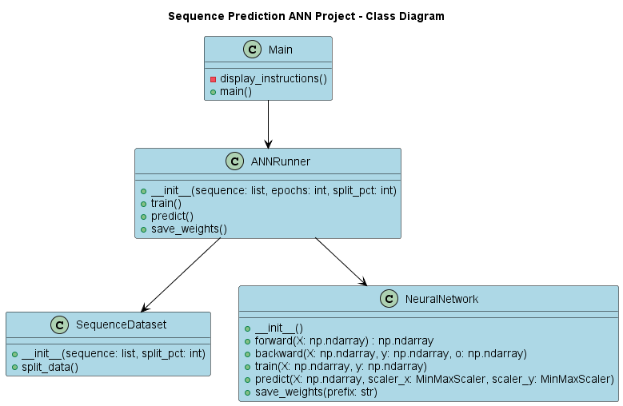

# Sequence Prediction ANN

This repository contains a Python implementation of a simple Artificial Neural Network (ANN) for predicting the next number in a given sequence.

## Introduction to Artificial Neural Networks

Artificial Neural Networks (ANNs) are computational models inspired by the human brain, designed to recognize patterns, make predictions, and classify objects. They have been widely used in various domains, including finance, marketing, information systems, manufacturing, operations, and healthcare. An ANN consists of interconnected layers of artificial neurons that learn from input data by adjusting the weights between neurons through a process called training.

## Inspiration and Credits

This project is inspired by and modifies the source code available at [Enlight: Neural Network](https://enlight.nyc/projects/neural-network). The original project demonstrates the fundamentals of artificial neural networks and walks through the process of creating a simple ANN.

In our project, we have adapted the code to predict the next number in a given sequence. We have also added features such as data normalization, modularized code, and customizable parameters.

## Features

- Modularized code with separate classes for data preparation, neural network architecture, and training
- Uses a feedforward neural network with a single hidden layer
- Employs the Sigmoid activation function
- Trains using backpropagation and Mean Squared Error (MSE) loss function
- Splits input data into training and validation sets
- Normalizes input data using MinMaxScaler from scikit-learn

## How the ANN Works

The ANN in this project functions through a process called forward-propagation, where the input data is passed through the network layers to produce an output. The network then calculates the error between the predicted output and the actual output using the Mean Squared Error (MSE) loss function. To minimize this error, the ANN adjusts the weights between neurons using a process called backpropagation. This learning process continues iteratively for a specified number of epochs to improve the ANN's predictions.

## User Diagram

## Activity Diagram

## Class Diagram

## Sequence Diagram

## Dependencies

- Python 3.x
- NumPy
- scikit-learn

## Usage

1. Clone the repository
2. Install dependencies: `pip install -r requirements.txt`
3. Run the main script: `python main.py`
4. Input a sequence of numbers separated by spaces when prompted (e.g., 2 4 6 8 10)
5. Observe the ANN's training progress and final predictions based on the validation data

## Customization

You can customize various parameters such as the number of epochs, percentage of data used for training, and the number of neurons in the hidden layer by modifying the constants in the main script.

## Example Use Cases

This sequence prediction ANN can be used to predict the next number in various types of numeric sequences, such as:

- Stock prices or financial time series data
- Weather data, such as temperature or precipitation patterns
- Production or sales data in business forecasting
- Biological data, such as gene expression patterns

## Future Improvements

To further enhance the capabilities of this sequence prediction ANN, future improvements could include:

- Implementing additional activation functions, such as Rectified Linear Activation (ReLU) or Hyperbolic Tangent (Tanh)
- Adding more hidden layers to create a deeper neural network architecture
- Integrating regularization techniques to prevent overfitting, such as L1 and L2 regularization or dropout
- Optimizing the learning process by implementing advanced optimization algorithms, such as Adam, RMSProp, or AdaGrad
- Incorporating time series-specific techniques, like Long Short-Term Memory (LSTM) or Gated Recurrent Units (GRU), for better handling of temporal dependencies in the data
